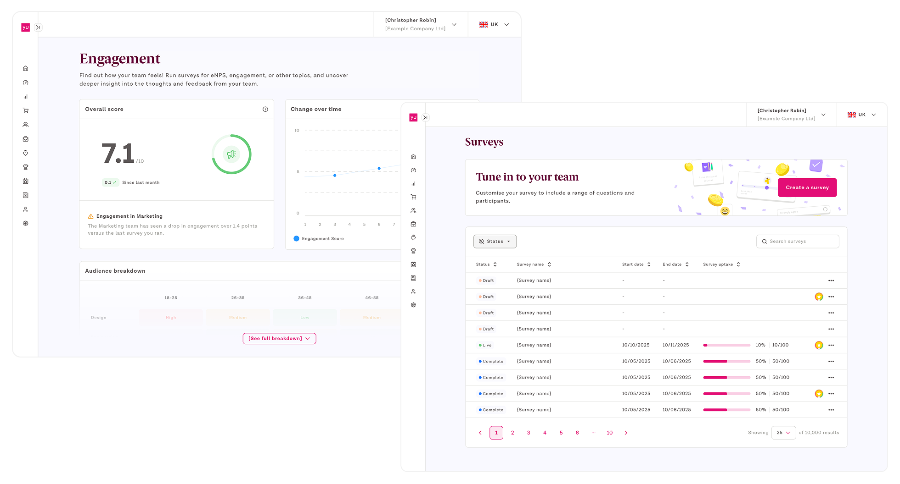
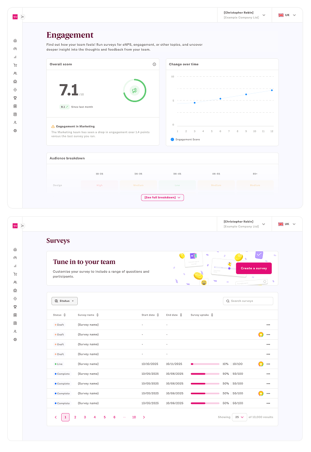
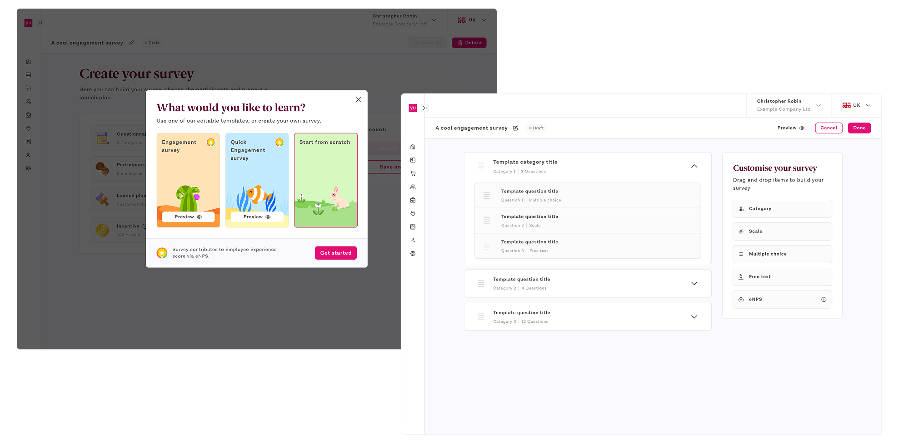
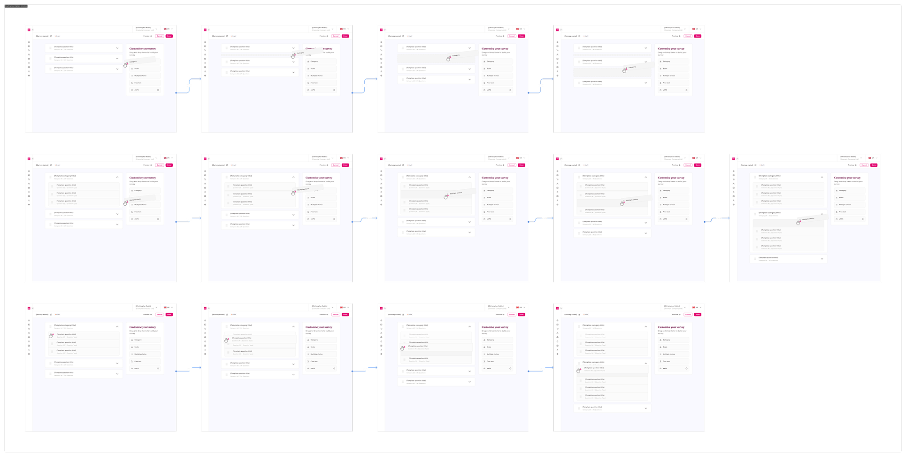
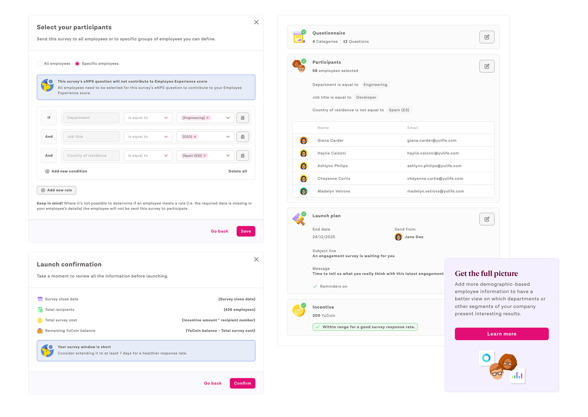
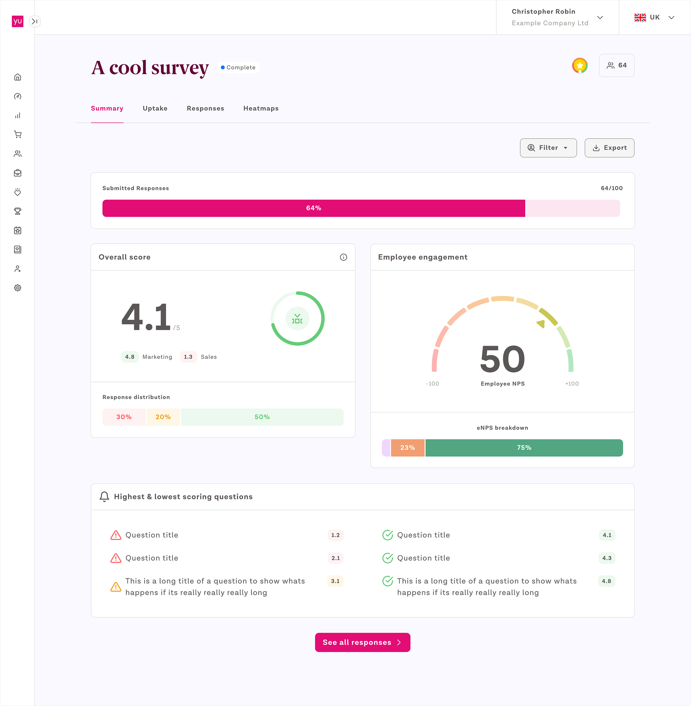
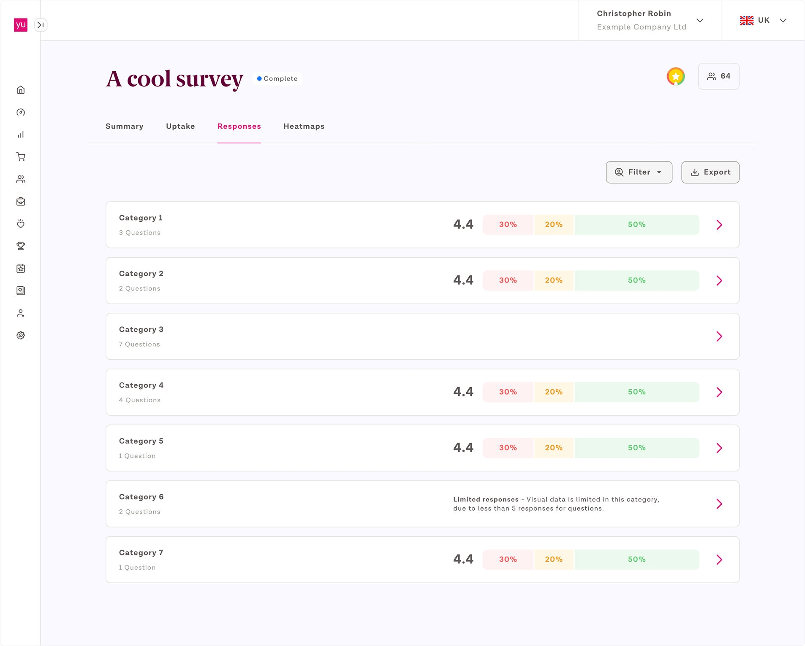
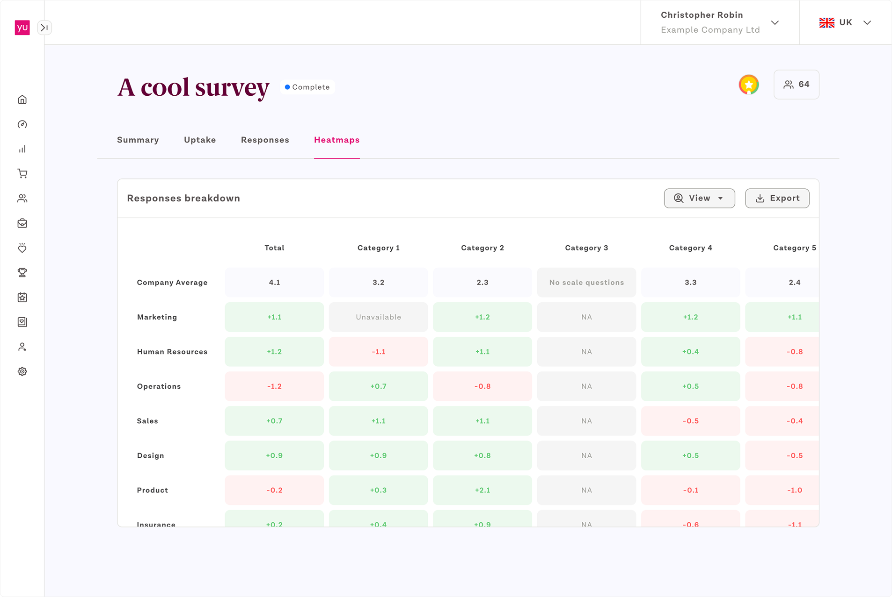

import hh1 from '../../images/case-study/helping-hand-1.png';
import hh2 from '../../images/case-study/helping-hand-2.png';
import sf1 from '../../images/case-study/survey-fun-1.png';
import sf2 from '../../images/case-study/survey-fun-2.png';
import sr1 from '../../images/case-study/survey-research-1.png';
import sr2 from '../../images/case-study/survey-research-2.png';
import sr3 from '../../images/case-study/survey-research-3.png';
import sr4 from '../../images/case-study/survey-research-4.png';
import srm1 from '../../images/case-study/survey-research-1-mob.png';
import srm2 from '../../images/case-study/survey-research-2-mob.png';
import srm3 from '../../images/case-study/survey-research-3-mob.png';
import srm4 from '../../images/case-study/survey-research-4-mob.png';
import srm5 from '../../images/case-study/survey-research-5-mob.png';
import srm6 from '../../images/case-study/survey-research-6-mob.png';

    

    

<TitleBar title="Intro & Impact" label="Product" stickyIndex={1} />

## Origin & Problem
At YuLife we had access to a lot of data about users; steps, physical activity, mood and so on, as part of a wider project we wanted to start delivering that data back to HR users and managers in the form of health insights, allowing decisions to be made with best possible insight. <strong>The task was designing a sub feature of that around engagement - with a simple survey tool to gather insights directly from employees whether they used the app or not</strong>.

<GoalCard title="Business Goal" variant="teal">
    
Provide engagement data back to HR users about their employees, helping to reduce absenteeism, burnout and other risk factors through simple surveys.

</GoalCard>

<GoalCard title="User Impact Goal" variant="orange">
    
Build a quick and convenient way for a HR user to create pre-designed or custom surveys and distribute them to their employees via either the web or YuLife app.

</GoalCard>

## How it works
HR users can build a survey from scratch or use a predefined survey via the Portal for their company. We built a variety of question types and an editor that allowed categorisation and even pulled in the industry standard NPS format for a question. How did we know to design it this way - <strong>through interviews with HR leaders currently using YuLife and deep-dives across other tools on the market</strong>.  They can select a specific set of users, build a launch plan and even offer an incentive for completion, all factors in obtaining the information to make informed choices on employee wellbeing and engagement.

## Impact
This was the last project I worked on at YuLife before it was restructured, as such this only made it as far as an early development build and therefore we have no impact stats.

<TitleBar title="Research & Wireframes" label="UX" stickyIndex={2} />

## Let’s take at how we built an end-to-end survey tool...
The first stage of research was competitor analysis where I looked at current survey providers on the market and aimed for feature parity at least.

From there like most projects, outlining a key, high-level flow for creating a survey is where I started. Once that was in a place which felt right based on research, I expanded out into a larger set of wire frames built partly from known components/patterns in our system and new, necessary ones I would need to build in order to achieve the end product.

    <Carousel images={[sr1, sr2]} 
    alts={[]} />

    <Carousel images={[srm1, srm2, srm3]} 
    alts={[]} />

    <Carousel images={[sr3, sr4]} 
    alts={[]} />

    <Carousel images={[srm4, srm5, srm6]} 
    alts={[]} />

<TitleBar title="UI Stages" label="Design" stickyIndex={3} />

## Making the survey fun to build
During market analysis I noticed the range of survey builders out there seemed cumbersome and boring to use, I tried to mitigate that with our use of brand elements and iconography from the beginning. The survey builder homepage brings our brand personality out in template selection. Then came the drag-and-drop editor for the survey. <strong>I focused time crafting the interactive elements, making them feel snappy to use and offering a lot of visual indicators as to what was possible</strong>.

    

 
    <Carousel images={[sf1, sf2]} 
    alts={[]} />

## Animation reference
Laying out in-depth animation and interaction references for how the editor should work. I also <strong>built out a proof of concept using Bolt AI to test the feel and timing of the animations</strong> before committing to build.

    

## A helping hand
From research with HR users, I found out that there was a lack of clarity over best practices for surveys. To counter this, building in extra prompts and action tips for helping users. <strong>Like noting if a survey contributes to engagement score, how by having more segmented data on employees could provide deeper insight and even down to an informational warning if they chose a close date too far or close in the future</strong>.

    

 
    <Carousel images={[hh1, hh2]} 
    alts={[]} />

## When a survey ends, the data cometh
The actual survey creation and distribution to users is only one part of the process. Once the survey ends, I designed a dashboard to make the results easy to digest and give enough information across question types and categories to guide decision making from a HR perspective. One of the biggest challenges here is ensuring that the HR user has provided as much data, ie. department per employee, as possible for more accurate results with components like heat maps.

One of the most challenging parts of designing the results dashboard was <strong>accounting for the variety of states available to a HR user based on either questions in the questionnaire, a lack of employee data or simply responses falling under our agreed data anonymity threshold</strong>.

