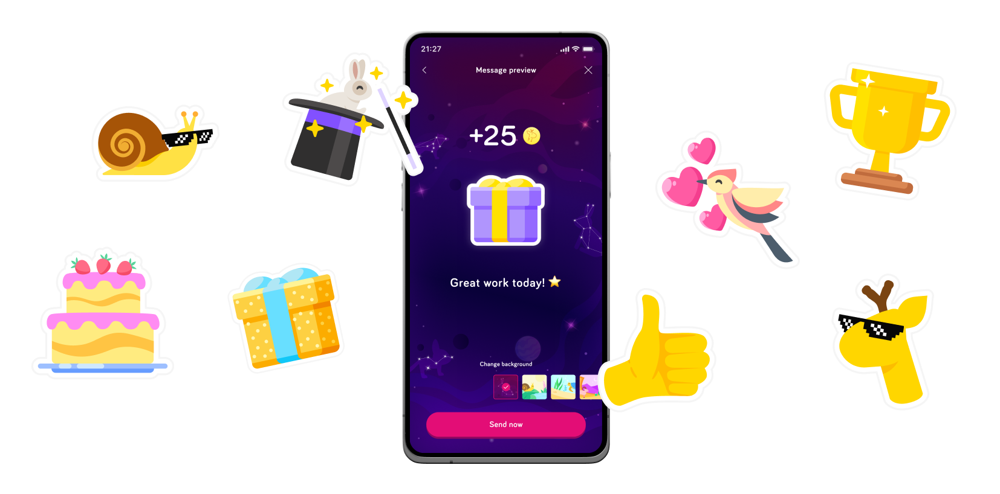
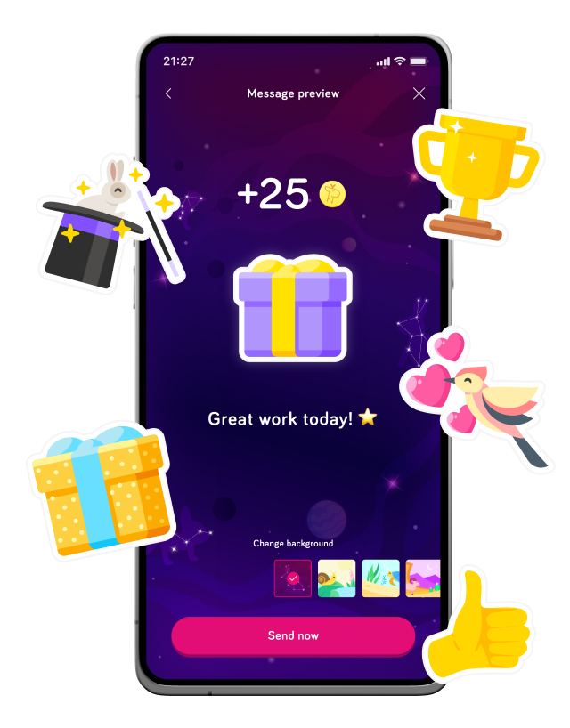
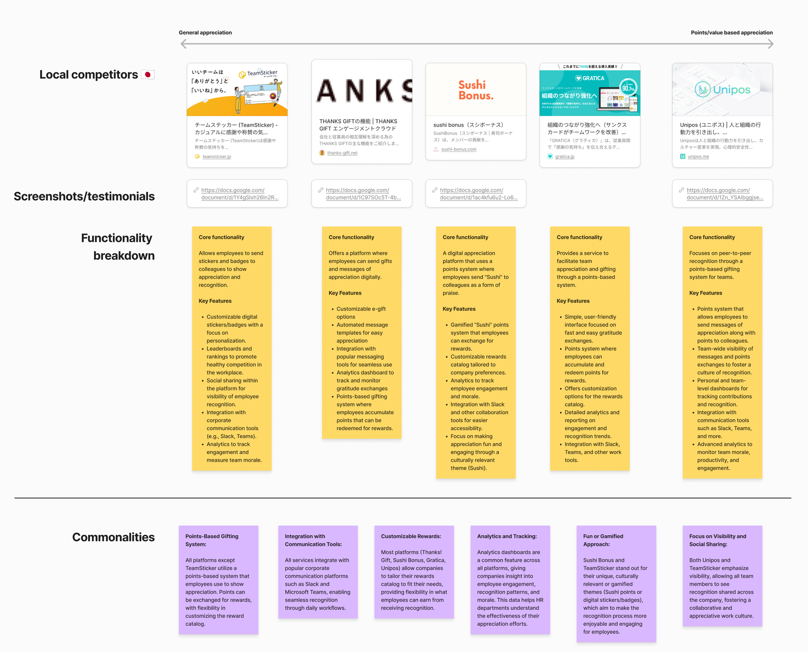
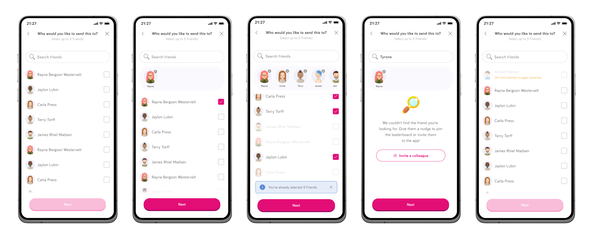
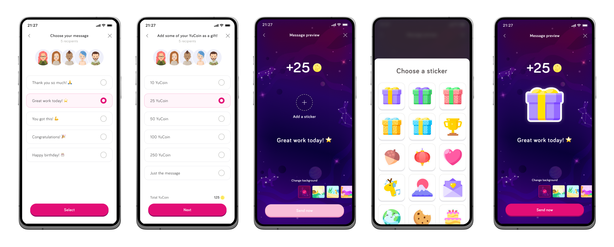

import giftLoader1 from '../../images/case-study/gifting-loader-mob-01.png';
import giftLoader2 from '../../images/case-study/gifting-loader-mob-02.png';
import giftCustom1 from '../../images/case-study/gifting-custom-mob-01.png'
import giftCustom2 from '../../images/case-study/gifting-custom-mob-02.png'
import giftCustom3 from '../../images/case-study/gifting-custom-mob-03.png'
import giftCustom4 from '../../images/case-study/gifting-custom-mob-04.png'
import giftCustom5 from '../../images/case-study/gifting-custom-mob-05.png'
import giftSpeed1 from '../../images/case-study/gifting-speed-mob-01.png'
import giftSpeed2 from '../../images/case-study/gifting-speed-mob-02.png'
import giftSpeed3 from '../../images/case-study/gifting-speed-mob-03.png'
import giftSpeed4 from '../../images/case-study/gifting-speed-mob-04.png'
import giftSpeed5 from '../../images/case-study/gifting-speed-mob-05.png'
import giftWires1 from '../../images/case-study/gifting-wires-1.png'
import giftWires2 from '../../images/case-study/gifting-wires-2.png'
import giftAnalysis1 from '../../images/case-study/comp-analysis-1.png'
import giftAnalysis2 from '../../images/case-study/comp-analysis-2.png'
import giftAnalysis3 from '../../images/case-study/comp-analysis-3.png'
import giftWiresMob1 from '../../images/case-study/gifting-wires-mob-1.png'
import giftWiresMob2 from '../../images/case-study/gifting-wires-mob-2.png'
import giftWiresMob3 from '../../images/case-study/gifting-wires-mob-3.png'
import giftWiresMob4 from '../../images/case-study/gifting-wires-mob-4.png'
import giftWiresMob5 from '../../images/case-study/gifting-wires-mob-5.png'

    

    

<TitleBar title="Intro & Impact" label="Product" stickyIndex={1} />

## Origin & Problem
The problem users faced was not having a simple way to give other people they work with recognition for ‘doing a good job’ or ‘top sudoku score’ without using a proper messaging channel such as Slack. We wanted to solve for that in a simple way, select a user, choose a message and sticker and away you go.

<GoalCard title="Business Goal" variant="teal">
    
Create a feature that makes employees feel more appreciated and in turn leads to higher engagement with their employer.

</GoalCard>

<GoalCard title="User Impact Goal" variant="orange">
    
Create a simple feature which users can utilise to express their appreciation of their colleagues and their hard work.

</GoalCard>

## Impact
Stats on usage of the system, but more importantly - this initial system laid the groundwork for a larger one to be built on top, Reward and Recognition from within our HR Portal - where managers and HR users could opt to send employees their own gifts as a reward for hard work or going to extra mile.
<MetricGrid metrics={frontmatter.metrics} />

## How it works
Designed and built on top of our current in-app search component, used for challenging people to duels, and around our leaderboard system - a user can select up to 5 other users to send a message to. They can customise their message from a pre-selected bank of simple phrases, a set of stickers and a set of backgrounds, giving a lot of possibilities. Optionally, they could add a preset YuCoin (in-app currency) amount for those really special friends.

<TitleBar title="Research & Wireframes" label="UX" stickyIndex={2} />

## Competitor analysis & main flow
We went deep on competitor analysis and what was being offered in the market (both Japan and the UK) - this formed the basis of what we wanted to build, helped inform the user stories and direction for the main flow of the feature.

    

 
    <Carousel images={[giftAnalysis1, giftAnalysis2, giftAnalysis3]} 
    alts={[]} />

    <Carousel images={[giftWires1, giftWires2]} 
    alts={[]} />

 
    <Carousel images={[giftWiresMob1, giftWiresMob2, giftWiresMob3, giftWiresMob4, giftWiresMob5]} 
    alts={[]} />

<TitleBar title="UI Stages" label="Design" stickyIndex={3} />

## Speed of design
This was a feature that needed to be built with speed, partly so we could get it out to users to test, but also to see the uptake for a feature like this. We had a lot of components already in place from our search feature, so we had to put them together and account for several edge cases for this specific use.

Firstly, we need to create one new component, the avatar tray, a simple way to show the users already selected for receiving a gift - pinned to the top of the screen and following a well known pattern from elsewhere. Then we had the actual search and the empty state associated with that. Finally, we had to consider potential abuse of the system. Two-fold, users who would try and game the currency system and simply users who you wouldn’t want to be contacted by. The first was a simple daily limit, the second involved a more meaningful opt-out flow from a single user.

    

    <Carousel images={[giftSpeed1, giftSpeed2, giftSpeed3, giftSpeed4, giftSpeed5]} 
    alts={[]} />

## Simple customisation
We wanted this whole experience to be simple - hence the design choice to opt for a lot of pre-selected options, in an attempt to keep the overall cognitive load down for the user and the flow as short as possible. Starting with a simple set of stickers and only 5 message options felt right for that simplicity. We eventually added more variety in the messages and some more themed stickers after the initial testing phase as some users felt limited.

    

    <Carousel images={[giftCustom1, giftCustom2, giftCustom3, giftCustom4, giftCustom5]} 
    alts={[]} />

## A delight to receive
As part of this, we spent some time thinking about a simple but effective way to add subtle motion and delight to the gift when a user receives it. As part of this work we redesigned part of our notification inbox to give more visual distinction between gifts and messages.

When a user opens a gift, they see a simple animated loader themed around gifting, this felt nice but also allowed for the details in the customisation of the gift to be pulled from the server without delay - forced friction for a more pleasant experience. At this point, once opened, we designed a simple interaction for simply saying thanks - building a full circle moment of kindness.

    <VideoCard src="/videos/gifting-loader.mp4" />

    <Carousel images={[giftLoader1, '/videos/gifts-loader-mob.mp4', giftLoader2]} 
    alts={[]} />

