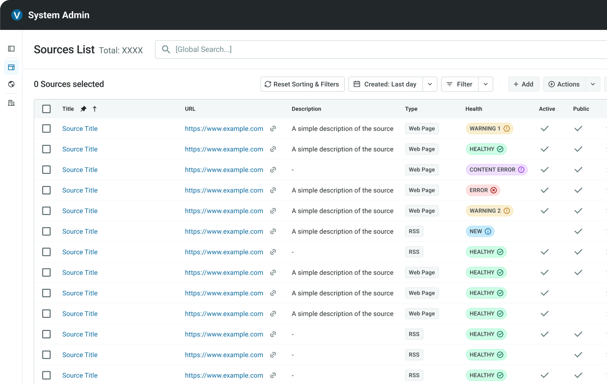

    

    

<TitleBar title="Intro & Impact" label="Product" stickyIndex={1} />

## Origin & Problem
Vable has a lot of legacy tech debt. An outdated, internal content editing platform which was built in piecemeal fashion over a decade ago and was confusing to use. The main admin platform was lacking consistency across its front-end, with multiple places utilising different patterns for solving the same problem. There was a design system in place, but it was overly complex and missing elements.

<strong>My task was to audit the design system, find holes in the content workflow, and design a new internal tool that could increase efficiency</strong>.

<GoalCard title="Business Goal" variant="teal">
    
Reduce complexity in design systems, in an attempt to improve adoption and prepare for using aith AI tools for faster prototyping.

</GoalCard>

<GoalCard title="User Impact Goal" variant="orange">
    
Find and spot gaps in the content team's workflows where we could improve and speed them up.

</GoalCard>

## Impact
Stats based on improved internal tooling. <strong>The main win being the implementation of Storybook based on the design system for internal tooling allowing for a much quicker 0-1 test</strong>.
<MetricGrid metrics={frontmatter.metrics} />

<TitleBar title="Research" label="UX" stickyIndex={2} />

## First-hand User experience
I spent a few days deeply invested with our two content team members, and inside documentation for how content is processed at Vable. <strong>I watched and observed how they worked via zoom</strong>, made notes and asked questions about what was working well and what was slowing down the process.

This research underpinned that the standard <strong>List View</strong> and <strong>Detail View</strong> approach of the platform was working but that the actual workflow between content items needed work.

<TitleBar title="Workflow" label="Product" stickyIndex={3} />

## New workflow pattern to save clicks
From watching the content team work, one area was clear where efficiences could be gained - 'Merging Publishers'. Everytime a new publisher for content was added to the system via clients sources, there was a check and if it already existed and then the two would be merged. <strong>The current process took the content team around 16 clicks, in and out of content to copy and delete pieces. Convoluted.</strong>

To solve this, I sketched out some simple flows and then brought them to life using known components from the design system tweaked to work for this internal tooling. I worked with a lead engineer to ensure the tech solution was feasible and then passed to the content team to check it worked for them as well. 

<strong>Overall this new workflow reduces clicks by around 5 each time, which when spread over approx 100 merges a week, the gains soon add up</strong>.