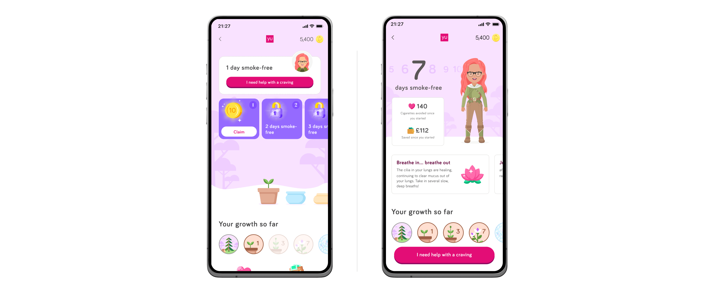

import testingScreenBefore from '../../images/case-study/smoking-testing-mob-before.png';
import testingScreenAfter from '../../images/case-study/smoking-testing-mob-after.png'; 
import smokingHub1 from '../../images/case-study/smoking-hub-mob-01.png';
import smokingHub2 from '../../images/case-study/smoking-hub-mob-02.png'; 
import smokingHub3 from '../../images/case-study/smoking-hub-mob-03.png'; 
import smokingHub4 from '../../images/case-study/smoking-hub-mob-04.png';
import smokingHub5 from '../../images/case-study/smoking-hub-mob-05.png';
import smokingHub6 from '../../images/case-study/smoking-hub-mob-06.png'; 
import smokingHub7 from '../../images/case-study/smoking-hub-mob-07.png'; 
import smokingHub8 from '../../images/case-study/smoking-hub-mob-08.png';  
import smokingQs1 from '../../images/case-study/smoking-questions-01.png';
import smokingQs2 from '../../images/case-study/smoking-questions-02.png';
import smokingQs3 from '../../images/case-study/smoking-questions-03.png';  
import smokingQs4 from '../../images/case-study/smoking-questions-04.png';  
import smokingQs5 from '../../images/case-study/smoking-questions-05.png';  
import smokingQs6 from '../../images/case-study/smoking-questions-06.png';  
import smokingQs7 from '../../images/case-study/smoking-questions-07.png';  
import smokingQs8 from '../../images/case-study/smoking-questions-08.png'; 
import smokingQs1Desktop from '../../images/case-study/smoking-questions-1-desktop.png';  
import smokingQs2Desktop from '../../images/case-study/smoking-questions-2-desktop.png'; 
import smokingHub1Desktop from '../../images/case-study/smoking-hub-1-desktop.png';
import smokingHub2Desktop from '../../images/case-study/smoking-hub-2-desktop.png';
import smokingCommitment2Desktop from '../../images/case-study/smoking-commitment-2-desktop.png';
import smokingCommit1 from '../../images/case-study/smoking-commit-01.png';
import smokingCommit2 from '../../images/case-study/smoking-commit-03.png';
import smokingCommit3 from '../../images/case-study/smoking-commit-04.png';
import smokingCommit4 from '../../images/case-study/smoking-commit-05.png';
import conceptOutline1 from '../../images/case-study/concept-outline-1-desktop.png';
import conceptOutline2 from '../../images/case-study/concept-outline-2-desktop.png';
import conceptOutlineMob1 from '../../images/case-study/concept-outline-1.png';
import conceptOutlineMob2 from '../../images/case-study/concept-outline-2.png';
import conceptOutlineMob3 from '../../images/case-study/concept-outline-3.png';
import conceptOutlineMob4 from '../../images/case-study/concept-outline-4.png';
import conceptOutlineMob5 from '../../images/case-study/concept-outline-5.png';
import conceptOutlineMob6 from '../../images/case-study/concept-outline-6.png';

  

    
  

  

    <VideoCard src="/videos/yuquit-demo-scroll.mp4" />
  

  <TitleBar title="Intro & Impact" label="Product" stickyIndex={1} />

  ## Origin & Problem
  Smoking is still one of the leading causes of health issues in the workplace, so much so that countries like Japan actually have an accreditation for employers who actively try to help tackle the problem (METI). At YuLife we wanted to provide a tool that could be given to employees alongside their health and wellbeing app, to help them tackle quitting.

  <GoalCard title="Business Goal" variant="teal">
    
Build a feature that can enable employees to have a better chance at quitting smoking, with the end goal of having an employee who is healthier - leading to reduced insurance premiums and risk of absenteeism.

  </GoalCard>

  <GoalCard title="User Impact Goal" variant="orange">
    
Support a user in their journey to quit smoking with a companion feature that helps them stay on track, rewards them for small daily actions and helps tackle cravings.

  </GoalCard>

  ## Impact
  Early launch usage stats. One other impact from the project, we now had <strong>a pattern for tackling other addiction issues like alcohol</strong>.
  <MetricGrid metrics={frontmatter.metrics} />

  ## How it works
  Backed by clinical research - we took the time to speak to several experts in smoking cessation and addiction - helping us to us to map out a 28 day plan for users within the app.
  
  Each day users are rewarded with small amounts of YuCoin (our in-app currency) and also served CBT insights in the form of information on how their body is reacting to being smoke-free. We try to enact behaviour change by tackling the triggers and motivations for each person, as well as surfacing data on how much money they have saved and the number of cigarettes avoided.
  
  Users can log progress daily in the app, and gain milestones during the 28 days. Once they complete the 28 day streak, they are 5x more likely to quit for good.

  <TitleBar title="Research & Wireframes" label="UX" stickyIndex={2} />

  ## We took what we learnt from research and speaking to experts and created flows
  We conducted interviews with experts in addiction and cognitive behavioural therapy techniques. Alongside those interviews, we did competitor analysis across a range of other apps designed to help with addiction, including the NHS app.
  

    <Carousel images={[conceptOutline1, conceptOutline2]} alts={[]} captions={['From this insight we developed a high level flow, based over a 28 day period, as per the expert advice. Highlighting areas where we could add useful CBT advice and reward users for actions they have taken.', 'From this insight we developed a high level flow, based over a 28 day period, as per the expert advice. Highlighting areas where we could add useful CBT advice and reward users for actions they have taken.']}/>
  

  

    <Carousel images={[conceptOutlineMob1, conceptOutlineMob2, conceptOutlineMob3, conceptOutlineMob4, conceptOutlineMob5, conceptOutlineMob6 ]} alts={[]} captions={[
      'From this insight we developed a high level flow, based over a 28 day period, as per the expert advice. Highlighting areas where we could add useful CBT advice and reward users for actions they have taken.',
      'From this insight we developed a high level flow, based over a 28 day period, as per the expert advice. Highlighting areas where we could add useful CBT advice and reward users for actions they have taken.',
      'From this insight we developed a high level flow, based over a 28 day period, as per the expert advice. Highlighting areas where we could add useful CBT advice and reward users for actions they have taken.',
      'From this insight we developed a high level flow, based over a 28 day period, as per the expert advice. Highlighting areas where we could add useful CBT advice and reward users for actions they have taken.',
      'From this insight we developed a high level flow, based over a 28 day period, as per the expert advice. Highlighting areas where we could add useful CBT advice and reward users for actions they have taken.',
      'From this insight we developed a high level flow, based over a 28 day period, as per the expert advice. Highlighting areas where we could add useful CBT advice and reward users for actions they have taken.'
    ]}/>
  

  ## Wireframes
  You can see above the high level flow for a user on their journey to quitting. It was important to add in progress tracking as part of their loop, including what happened if a user lapsed and how we could support in both instances. The flow outlines what we expected at each stage and what we required for the users.

  <TitleBar title="UI Stages" label="Design" stickyIndex={3} />

  

    <Carousel images={[smokingQs1Desktop, smokingQs2Desktop]} alts={[]}/>
  

  

    <Carousel images={[smokingQs1, smokingQs2, smokingQs3, smokingQs4, smokingQs5, smokingQs6, smokingQs7, smokingQs8]} 
    alts={[                                                                                                                         
    'Onboarding welcome screen encouraging users to start their quit-smoking journey, explaining that stopping for 28 days makes you 5x more likely to quit for good',        
    'Onboarding question asking which tobacco products the user smokes, with radio options for cigarettes, roll-ups, or both',                                                
    'Onboarding question asking how many cigarettes or roll-ups the user smokes per day, with a numeric text input',                                                          
    'Onboarding question asking how much the user spends on smoking products per week, with a pound sign prefixed text input',                                                
    'Onboarding question asking what motivates the user to quit, with checkboxes for health, appearance, money, family, partner, smell, and a custom option',               
    'Onboarding question asking when the user tends to have their first smoke of the day, with radio options ranging from as soon as they wake up to at night',
    'Onboarding question asking when throughout the day the user usually smokes, with checkboxes for triggers including alcohol, coffee, stress, waking up, after meals, driving, and boredom',
    'Onboarding question asking how confident the user is about completing 28 smoke-free days, with radio options from very confident to not confident',
    ]} />
  

  ## Questions & Commitment
  We built a formulated set of questions, based on research with subject matter experts and from other similar addiction apps, which allowed us to find out potential triggers and motivations for users, as well as gauging other causal effects and an overall confidence level of the users actively jumping into a quit journey.
   
  After completing the questions - users are faced with some facts based on their input. These are designed to reinforce their decision to quit; things like the money they could save and social proof of other user’s on their own journey. It was important to add an element of friction for the commitment step, as research showed that if a user feels they have physically interacted with their journey, they are more likely to succeed. This is where the commitment animation and growth metaphor starts to become more prevalent in their journey, as well as requesting the user to achieve some simple, real-world activities before starting.

  

    <Carousel images={['/videos/smoking-commit-vid.mp4', smokingCommitment2Desktop]} alts={[]} />
  

  

    <Carousel images={[smokingCommit1, '/videos/smoking-commit-02.mp4', smokingCommit2, smokingCommit3, smokingCommit4]} alts={[]} />
  

  ## The smoking hub
  Once a user committed to quitting - we supported them with a dedicated hub in the app. On a daily basis they could jump into the hub and log their progress, good or bad, and be rewarded for how far they had come on their journey so far. A gamified mechanic, in which they are given in-app currency per day they are smoke-free was utilised to encourage them to build a recurring loop. Alongside this reward, each day up to 28, we also offered the user a physical tip explaining what was actually happening to their body and how beneficial each smoke-free day was - another CBT approach to subtly reinforce their actions.

  We designed into the hub a section for a user to be able to constantly remind themselves of their reasons for quitting and also those elements of their daily life which could trigger a craving. From their self-reflection on their triggers, we built a system of content cards to help user’s understand and plan for those moments and how to tackle them - we found from research this step offered extra cognitive reasoning for making it to the 28 day milestone.

  Cravings? We knew from research that one of the reasons people lapse is due to the nature of cravings and to tackle it we built a whole game in the app to give user’s hands something to focus on and engage with. The average craving lasts around 4 minutes, so we built in haptic and visual feedback to the game letting a user know when they were past the craving window.

  

    <Carousel images={[smokingHub1Desktop, smokingHub2Desktop]} alts={[]} />
  

  

    <Carousel images={[smokingHub1, smokingHub2, smokingHub3, smokingHub4, smokingHub5, smokingHub6, smokingHub7, smokingHub8]} 
    alts={[                                                                                                                         
    'YuQuit home screen showing 7 days smoke-free, 140 cigarettes avoided, £112 saved, a breathing exercise card, and an avatar with growth badges',                          
    'Profile settings screen showing trigger moments (drinking alcohol, after a meal, procrastination) and quit motivations (save money, family, health), plus a contextual craving tip card',                                                                                                                                                          
    'Craving tips screen showing advice cards for situations: when others are smoking, when driving, when bored, and after a meal',                                           
    'Health milestones timeline showing benefits after 24 hours, a breathing exercise, after 21 days, and on day 28, spanning from day 1 to day 28',                        
    'YuQuit home screen with a darkened overlay, showing 7 days smoke-free stats and an "I need help with a craving" CTA button',
    'Craving distraction mini-game: a 2048-style tile puzzle with animal illustrations, showing current score, high score, and a restart option',
    'Mid-game craving distraction screen with a modal overlay reminding the user that the average craving only lasts 3 minutes, with an "I can do it!" button',
    'Game completion screen showing a trophy animation, "2 cravings managed" message, and encouragement to keep going, with restart and exit options',
  ]} />
  

  <TitleBar title="Usability" label="Testing" stickyIndex={4} />

  ## Usability testing to the rescue
  The designs above are where we ended up, but prior to this we tried to go even harder with the plants representing the growth metaphor. Originally the idea was to have a set of four plants, linked to our in-app worlds, with each one growing a little bit with each day a user was smoke-free. <strong>We also made the YuCoin reward have to be claimed by a user per day. Both of these elements led to friction points in usability testing.</strong>

  We ran a set of tests on Maze and with real users on an early development build. The results told us that in the majority of cases, the users did not grasp the metaphor concept, we’re confused about the plants and the empty space initially - plus the <strong>claim rail component wasn’t clear how to use it (even though its a pattern we took from elsewhere in the app.)</strong> This led us to rethink the overall complexity of the screen and what we had designed.

  The new version had <strong>more clarity, performed better in usability and brought more useful information to the user in the first few days of their experience.</strong>
  

    
  

  

    <Carousel images={[testingScreenBefore, testingScreenAfter]} 
    alts={['An app screenshot of the Smoking Hub before testing, showing an unclear CTA button, mixed growth metaphor and no CBT tools above the screen break', 'An app screenshot of the Smoking Hub after user testing showing a clearer heirarchy, consistent placed CTA button, and CBT cards that can be scrolled']} 
    captions={['Before testing:\nPrimary CTA didn’t follow the pattern in rest of the app\nToo much space given to the visual aspects of the plants, which were unclear as to purpose\nRail for claiming daily rewards caused confusing\nImportant CBT tools required scrolling', 'After testing:\nCBT tools given centre stage - money saved, etc.\nPrimary CTA pattern follows rest of the app\nMore visual weight given to days a user has been smoke-free\nTips surfaced without scroll']}/>
  
