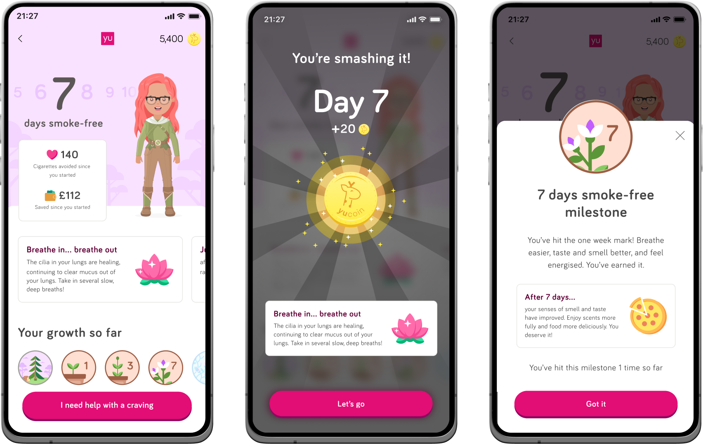

  <TitleBar title="Intro & Impact" label="Product" stickyIndex={1} />

  ## Origin & Problem
  Smoking is still one of the leading causes of health issues in the workplace, so much so that countries like Japan actually have an accreditation for employers who actively try to help tackle the problem (METI). At YuLife we wanted to provide a tool that could be given to employees alongside their health and wellbeing app, to help them tackle quitting.

  <GoalCard title="Business Goal" variant="teal">
    
Build a feature that can enable employees to have a better chance at quitting smoking, with the end goal of having an employee who is healthier - leading to reduced insurance premiums and risk of absenteeism.

  </GoalCard>

  <GoalCard title="User Impact Goal" variant="orange">
    
Support a user in their journey to quit smoking with a companion feature that helps them stay on track, rewards them for small daily actions and helps tackle cravings.

  </GoalCard>

  ## Impact
  Early launch usage stats. One other impact from the project, we now had <strong>a pattern for tackling other addiction issues like alcohol</strong>.
  <MetricGrid metrics={frontmatter.metrics} />

  ## How it works
  Backed by clinical research - we took the time to speak to several experts in smoking cessation and addiction - helping us to us to map out a 28 day plan for users within the app. Each day users are rewarded with small amounts of YuCoin (our in-app currency) and also served CBT insights in the form of information on how their body is reacting to being smoke-free. We try to enact behaviour change by tackling the triggers and motivations for each person, as well as surfacing data on how much money they have saved and the number of cigarettes avoided.
  Users can log progress daily in the app, and gain milestones during the 28 days. Once they complete the 28 day streak, they are 5x more likely to quit for good.

  <TitleBar title="Research & Wireframes" label="UX" stickyIndex={2} />

  ## We took what we learnt from research and speaking to experts and created flows
  We conducted interviews with experts in addiction and cognitive behavioural therapy techniques. Alongside those interviews, we did competitor analysis across a range of other apps designed to help with addiction, including the NHS app. From this insight we developed a high level flow, based over a 28 day period, as per the expert advice. Highlighting areas where we could add useful CBT advice and reward users for actions they've taken.

  

  ## Wireframes
  You can see above the high level flow for a user on their journey to quitting. It was important to add in progress tracking as part of their loop, including what happened if a user lapsed and how we could support in both instances. The flow outlines what we expected at each stage and what we required for the users.

   <TitleBar title="UI Stages" label="Design" stickyIndex={3} />

   ## Questions & Commitment
   We built a formulated set of questions, based on research with subject matter experts and from other similar addiction apps, which allowed us to find out potential triggers and motivations for users, as well as gauging other causal effects and an overall confidence level of the users actively jumping into a quit journey.
   
   After completing the questions - users are faced with some facts based on their input. These are designed to reinforce their decision to quit; things like the money they could save and social proof of other user’s on their own journey. It was important to add an element of friction for the commitment step, as research showed that if a user feels they have physically interacted with their journey, they are more likely to succeed. This is where the commitment animation and growth metaphor starts to become more prevalent in their journey, as well as requesting the user to achieve some simple, real-world activities before starting.